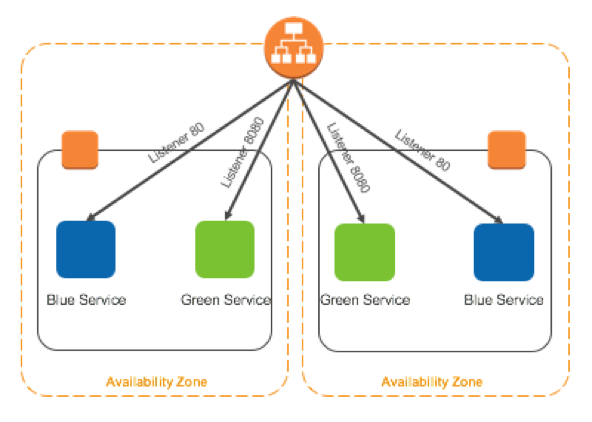

## Create AWS VPC and Setup Up Blue Green Deployment Capability

Build:
- VPC with 2 public Subnets, 2 Routes, Routing Table and Internet Gateway
- Elastic Load Balancer, EC2s launched via autoscaling group using %cpu as scaling trigger.
- Extra Infra to perform BLUE-Green upgrades



### Expectations 
It will always be *best* to start from scratch with a new VPC.

The process should take between 2-4 min on average.


### Installing
```
git clone https://github.com/jouellnyc/AWS
```

### Usage
- cd boto3/blue_green_deploy

- edit prod_build_config.py to taste. 

- python3 ./prod_vpc_lb_builder.py

(I suggest Using Spyder or a REPL - that way you can print the 'prod_vpc' object easily to debug.)

## Authors
[jouellnyc](mailto:jouellnyc@gmail.com)

## License
This project is licensed under the MIT License

## Acknowledgments
*Thanks AWS!*
